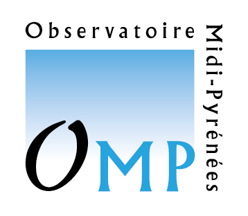

<!-- PROJECT LOGO -->
<br/>
<p align="center">
  <a href="https://github.com/AkaiiKitsune/OMP-GestionPic">
    
  </a>

  <h3 align="center">OMP Stage MMI 2</h3>

  <p align="center">
    Une application permettant de gerer des chambres...
    <br/>
    <a href="https://github.com/AkaiiKitsune/OMP-GestionPic"><strong>Documentation</strong></a>
    <br/>
  </p>
</p>


<!-- TABLE OF CONTENTS -->
## Table of Contents

* [A propos](#a-propos)
  * [Frameworks](#frameworks)
* [Pour commencer](#pour-commencer)
  * [Prérequis](#prérequis)
  * [Installation](#installation)
  * [Configuration](#configuration)
* [Utilisation](#Utilisation)


<!-- ABOUT THE PROJECT -->
## A Propos
![Profile Screen Shot][profil-screenshot]

Cette application a été réalisée dans le cadre de mon **stage de fin d'année** en seconde année de **DUT MMI à l'IUT de Tarbes**.
J'avais pour devoir de réaliser une application de gestion de ressources pour l'**Observatoire Midi-Pyrénées** du Pic Du Midi de Bigorre (https://www.omp.eu/)

Elle devait en autre permettre de :
* Gerer les capacités d'accueil du Pic en permettant de :
  * Reserver des chambres
  * Affecter des missionnaires à leur chambres respectives
  * Permettre de visualiser quelles chambres doivent etres entretenues ou pas.
* Gerer les salles de reunions
* Gerer les laisser passer
* Permettre de générer des rapports financiers sur l'utilisation des chambres

L'idée était de faciliter le travail de gestion pour le personel qui gère l'organisation du pic. 


<br/>

### Frameworks
L'application utilise ces differentes librairies et frameworks pour fonctionner :
* [NodeJS](https://nodejs.org)
* [Express](https://expressjs.com)
* [Mongoose](https://mongoosejs.com)
* [Bootstrap](https://getbootstrap.com)
* [Bootstrap-select](https://developer.snapappointments.com/bootstrap-select)
* [JQuery](https://jquery.com)
* [FontAwesome](https://fontawesome.com)


<!-- GETTING STARTED -->
## Pour commencer
Cette application a été réalisée pour etre utilisée sur **Debian 10.4**, en revanche toute distribution fait affaire tant que Node.js et MongoDB sont installés.

La machine doit avoir au minimum :
* CPU : 2 cores minimum, 4 ou + recommendé
* RAM : 2Go minimum, 4Goou+recommendé
* Disque : 20Go minimum, 100Go ou + recommendé

Et **le port 8080 doit etre accessible**.


<br/>

<!-- Prérequis -->
### Prérequis
L'application a besoin de trois paquets pour fonctionner : Git, MongoDB et Nodejs.
* git
```sh
sudo apt install git
```

* NodeJS (latest)
```sh
sudo apt install nodejs
```

* MongoDB (4.2 : *https://docs.mongodb.com/manual/tutorial/install-mongodb-on-debian*)
```sh
wget -qO - https://www.mongodb.org/static/pgp/server-4.4.asc | sudo apt-key add -
echo "deb http://repo.mongodb.org/apt/debian buster/mongodb-org/4.4 main" | sudo tee /etc/apt/sources.list.d/mongodb-org-4.4.list
sudo apt-get update
sudo apt-get install -y mongodb-org
sudo systemctl start mongod
sudo systemctl enable mongod
```


<br/>

<!-- Installation -->
### Installation
1. Cloner le repo et entrer dans le repertoire de celui ci
```sh
git clone https://github.com/AkaiiKitsune/OMP-GestionPic && cd ./OMP-GestionPic
```

2. Installer les packets NPM
```sh
npm install
```

3. Ajouter la clé d'api dans /config/secrets.js (La clé est a générer sur https://api.insee.fr/catalogue/, dans la rubrique API Sirene V3)
```JS
module.exports={secretSirenAPI:'xxxxxxxx-xxxx-xxxx-xxxx-xxxxxxxxxxxx'};
```

4. Demarrer l'application (Le serveur devient alors disponible sur le port 8080 de la machine)
```sh
npm run start
```
Un serveur nodemon demarre, il relancera l'application si des modifications sont effectuées a son code source ou si un crash a lieu.


<br/>

<!-- Installation -->
### Configuration
Il faut avant toute chose creer le compte administrateur et lui donner ses droits. La modification de droits utilisateurs demande un acces au terminal de la base de donnée MongoDB, et c'est la seule operation demandant a un acces direct a celle ci.

Il faut proceder de la sorte :
1. Creer le compte administrateur sur l'interface web (en le nommant admin en minuscules, c'est important pour la commande qui va suivre)
![Register Screen Shot][register-screenshot]

2. Acceder au terminal MongoDB :
```sh
mongo mongodb://localhost:27017/omp 
```

3. Executer la commande suivante :
```sh
db.users.findAndModify({ query: { username: "admin" }, update: { $set: { admin: "true"} } })
```
Elle permet de mettre a jour le profil administrateur afin de lui donner ses droits. On peux maintenant quiter la console mongo en executant la commande `exit`

L'administrateur a maintenant acces au panel admin (Situé dans le menu dropdown).
Il va devoir maintenant ajouter differents emplacements a la base de donnée :
![Emplacement Screen Shot][emplacement-screenshot]

Ces emplacements seront ensuite selectionnables dans les interfaces de creation de mission et d'attribution des chambres.


Lorsque celle-cies sont ajoutées, la configuration de base peut etre considérée terminée, et l'utilisateur admin n'est plus important pour l'instant.


<br/>

<!-- USAGE EXAMPLES -->
## Utilisation
Après avoir crée un compte utilisateur, l'interface va demander de specifier les informations du missionnaire lié a ce compte.

Il suffit de remplir les informations demandées :
![Missionnaire Screen Shot][missionnaire-screenshot]


Une fois le compte crée, le profil de l'utilisateur ressemblera à ceci :
![Profile Screen Shot][profil-screenshot]

L'utilisateur a ici la possibilité de visionner les missions qu'il a planifié, et d'en ajouter de nouvelles :
![Add Mission Screen Shot][addMission-screenshot]

Les missions ajoutées s'affichent ensuite dans le profil de l'utilisateur :
![Mission List Screen Shot][missionList-screenshot]


<!-- MARKDOWN LINKS & IMAGES -->
[profil-screenshot]: images/profil.png
[register-screenshot]: images/register.png
[missionnaire-screenshot]: images/missionnaire.png
[emplacement-screenshot]: images/emplacement.png
[addMission-screenshot]: images/addMission.png
[missionList-screenshot]: images/missionList.png
